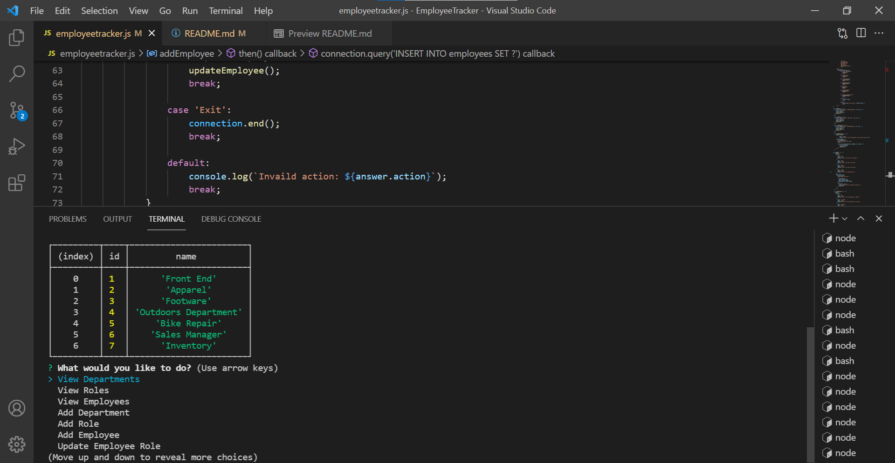

# EmployeeTracker

## **Project Summary** ⚡️

_This app is for a business owner who wants to to be able to view and manage departments, roles and employees to organize and run the business._

__________________________________________________________________________________________________________________________________________________

## **Tools Used** 🛠️

* JavaScript
* Node Js
* npm
* mysql

___________________________________________________________________________________________________________________________________________________

## **Steps**📋

* This is a node.js command line app. You are able to view departments, roles and employees.
You are also able to add departments, role and employees.
You can also update employee roles.

___________________________________________________________________________________________________________________________________________________

## **Website** 📷

___________________________________________________________________________________________________________________________________________________

# 📷 Video

[Live video Demo](https://youtu.be/9soPC39thcc)

___________________________________________________________________________________________________________________________________________________

## **Recourses** 💡

[Katherine Y : Github](https://github.com/katherineyoguez/EmployeeTracker)

____________________________________________________________________________________________________________________
